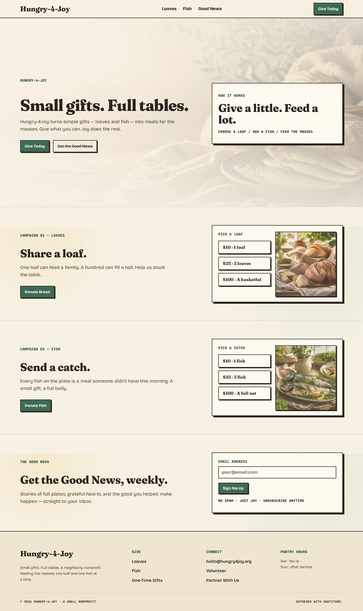
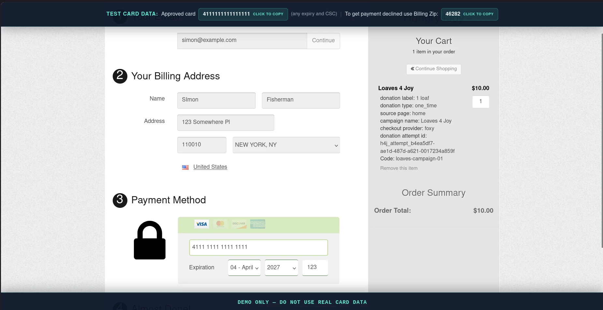
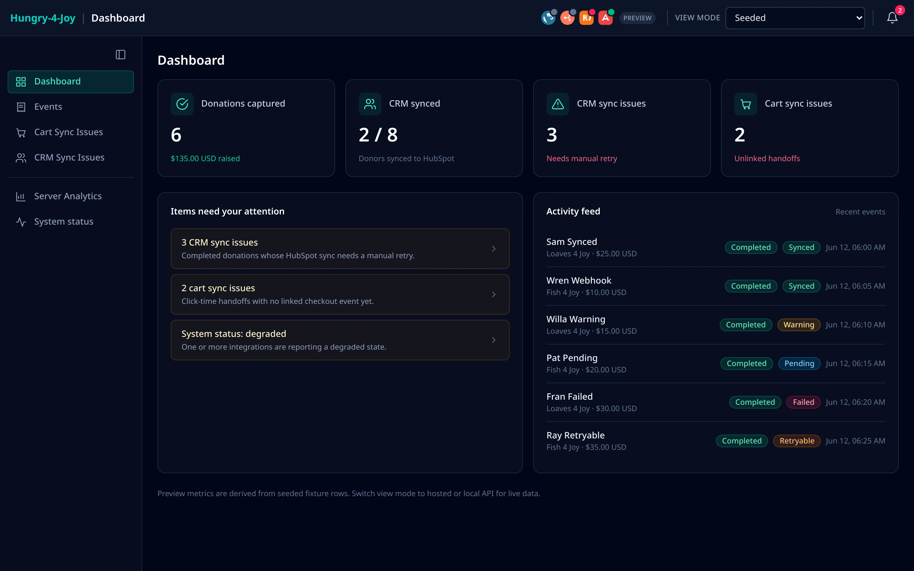
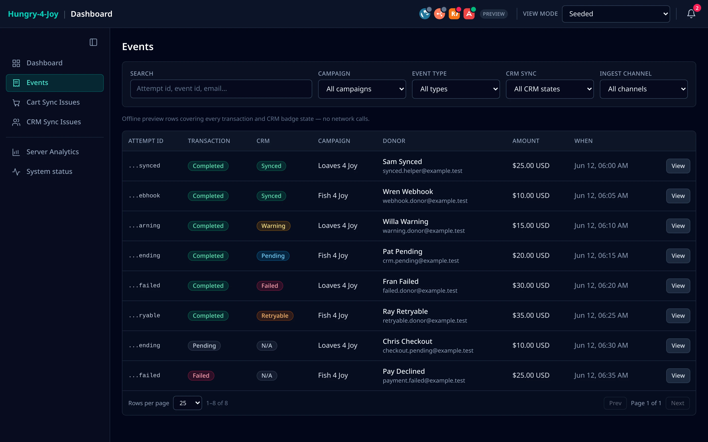
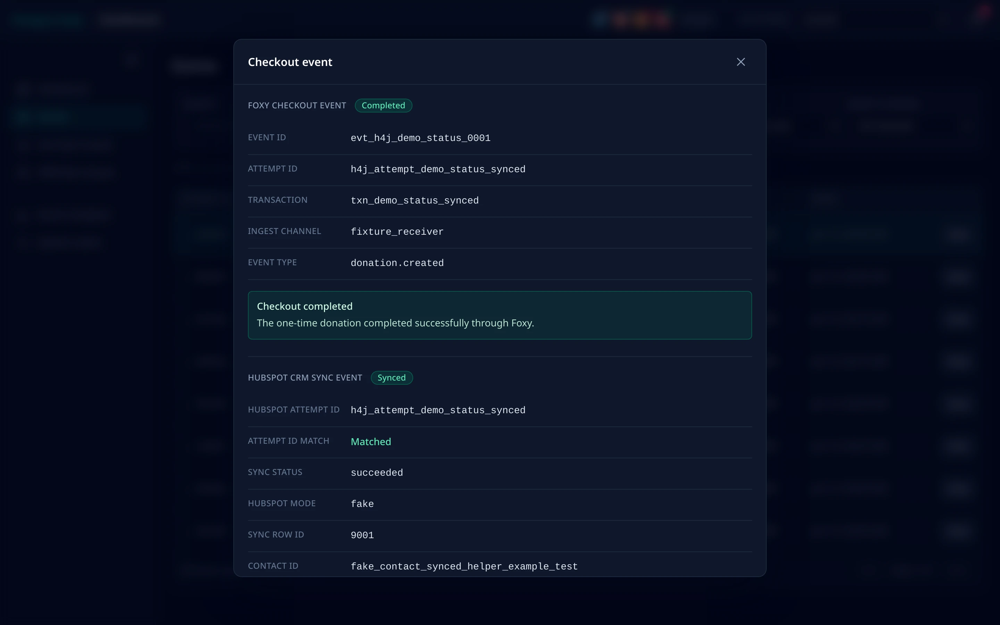
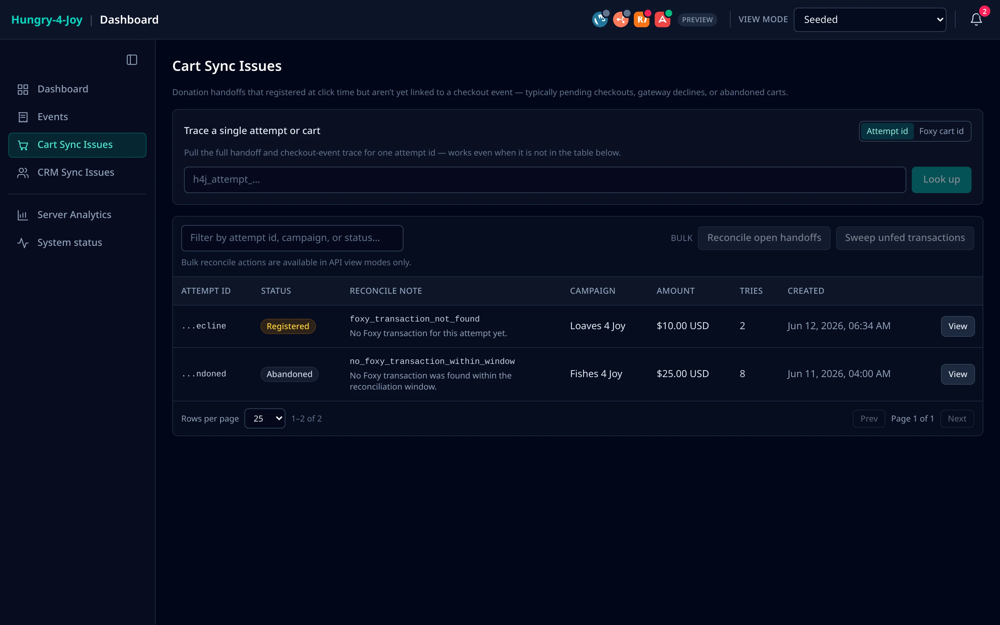
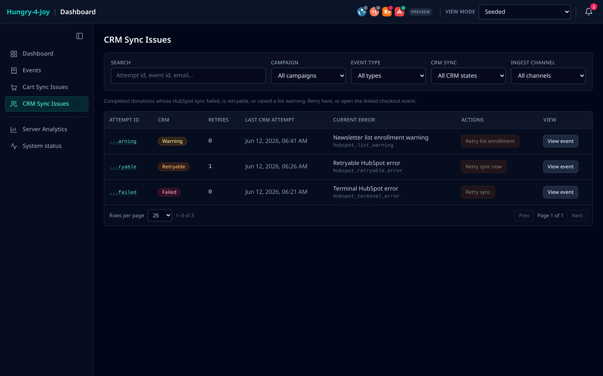
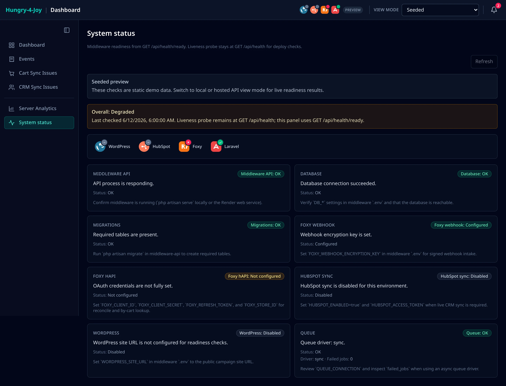
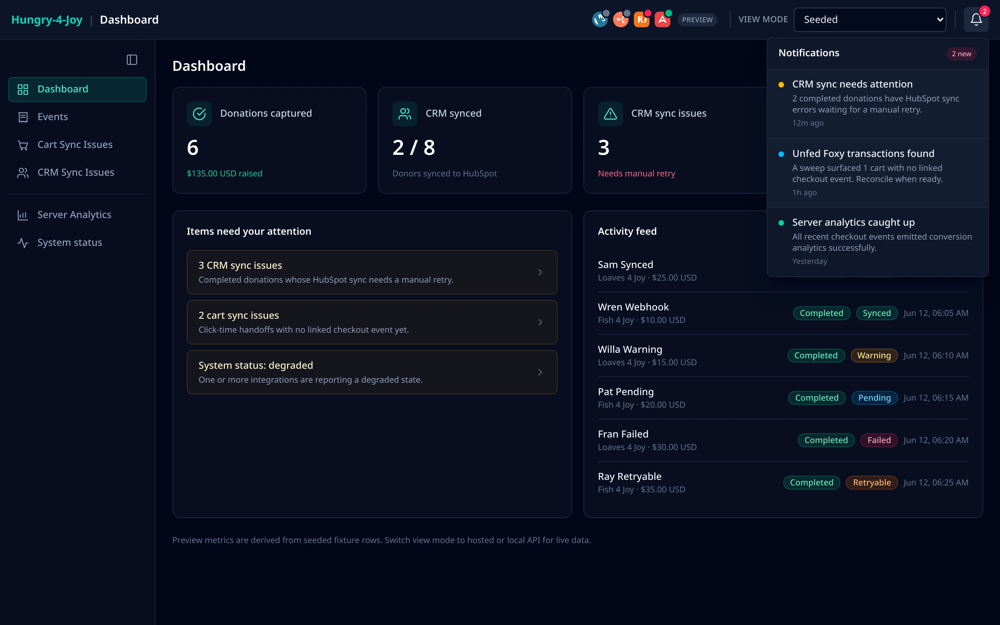
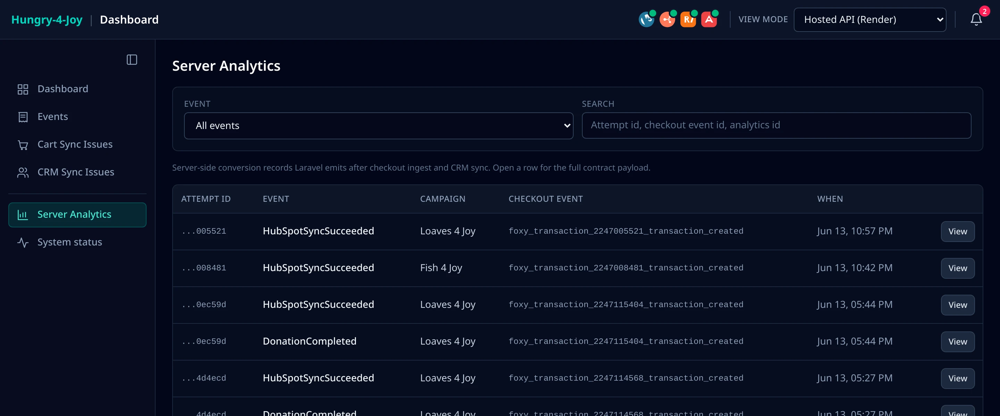

# Hungry-4-Joy

Hungry-4-Joy is a demo prototype of a lean nonprofit donation ecosystem.

The goal is to show how a public campaign site, checkout events, middleware, CRM sync, analytics, observability, and a support dashboard can work together as one small system.

This is not intended to become a full fundraising platform. It is a focused MVP for demonstrating integration architecture, operational workflows, and production-style support boundaries.

## See the project (Render)

Hosted demo services:

| Service | URL |
| --- | --- |
| Campaign site (WordPress) | [hungry-4-joy-wordpress.onrender.com](https://hungry-4-joy-wordpress.onrender.com) |
| Integration status dashboard | [hungry-4-joy-dashboard.onrender.com](https://hungry-4-joy-dashboard.onrender.com) |
| Middleware API health | [hungry-4-joy-middleware.onrender.com/api/health](https://hungry-4-joy-middleware.onrender.com/api/health) |

Start on the **campaign site** for the donation flow. Open the dashboard's
credential-free **Seeded** view to explore the support experience; live webhook
data and actions require operator access.

## Showcase

Screenshots from the running app in **seeded** mode (offline demo data), except Server Analytics, which is live API data.

The donor-facing campaign site (WordPress):



Donations check out through **Foxy**. Since this is a demo, a banner surfaces test-card details so anyone can run the full flow safely:

- **Approved payment** — card `4111 1111 1111 1111`, any future expiry, any CSC.
- **Declined payment** — use that card with **Billing ZIP `46282`**.



The custom React operations dashboard — checkout events, CRM sync health, unlinked carts, server analytics, and live system readiness:



<details open>
<summary><b>📸 Full screenshot tour</b> — Events, Cart/CRM sync, System status, and more</summary>

<br>

### Events

Every checkout event with its transaction and CRM sync state. Rows open a detail modal.



A single event's full trace — Foxy checkout event, HubSpot CRM sync, and server analytics — in one modal.



### Cart Sync Issues

Click-time donation handoffs not yet linked to a checkout event (pending checkouts, gateway declines, abandoned carts), with a single-id/cart trace lookup and bulk reconcile/sweep actions.



### CRM Sync Issues

Completed donations whose HubSpot sync failed, is retryable, or raised a list-enrollment warning — with one-click manual retry.



### System status

Per-integration readiness — middleware API, database, migrations, Foxy, HubSpot, WordPress — from the health endpoint.



### Notifications (seeded visual preview)

In-header notification presentation. Repeated-failure incident flags and
external alert delivery are not implemented.



### Server Analytics

Server-emitted conversion records produced after checkout ingest and CRM sync (live API data) — each row opens its full contract payload.



</details>

## Planned Ecosystem

```text
Donor / visitor
  |
  v
WordPress campaign site
  - campaign pages
  - donation buttons
  - one-time giving options
  - forms and content
  - campaign metadata
  |
  | donation amount / campaign selection
  v
Cart / Checkout
  - cart session
  - hosted checkout
  - modeled checkout handoff
  - campaign codes
  - transaction status
  |
  | webhook / transaction event
  v
Laravel middleware/API
  - validate webhook
  - normalize donor and donation data
  - deduplicate records
  - store application state
  - run CRM sync jobs synchronously in the current demo
  - retry failed syncs
  - log errors
  |
  +--> CRM / Marketing
  |      - contacts / donors
  |      - donation activity
  |      - campaign attribution
  |      - lists / segments
  |      - follow-up status
  |
  +--> Marketing analytics
  |      - browser events
  |      - server-side conversion events
  |      - consent-aware tracking
  |      - conversion reporting
  |
  +--> Observability / logging
  |      - webhook logs
  |      - sync failures
  |
  +--> Status dashboard
         - checkout events and webhook ingest
         - CRM sync status and failure detail
         - CRM sync issues and manual CRM retry
         - filters by campaign, status, and date
```

## Project Progress

Track implementation status in [GitHub Issues](https://github.com/ChristopherMedrano/hungry-4-joy/issues) and [Milestones](https://github.com/ChristopherMedrano/hungry-4-joy/milestones).

Operational recovery responsibilities and the current free-tier limitations are
documented in the
[backup, restore, and rollback runbook](docs/backup-restore-rollback.md).
Use the [MVP smoke-test checklist](docs/mvp-smoke-test-checklist.md) for the
final safe local rehearsal and any separately authorized hosted verification.
Start with the
[demo handoff and support runbook](docs/demo-handoff-support-runbook.md) when
evaluating, presenting, supporting, or transferring ownership of the demo.

## Project Stack

Frontend (WP/Dashboard):

- CMS: WordPress, campaign content.
- Theme: Twenty Twenty-Five, block foundation.
- Child theme: Hungry-4-Joy, project presentation.
- Style system: Sass/SCSS, compiled theme CSS.
- Status dashboard: Vite + React + Tailwind CSS in `dashboard/`.

Checkout and integrations:

- Checkout: Foxy.io / FoxyCart, hosted cart flow.
- CRM: HubSpot, donor contact sync.
- Analytics: marketing events, campaign tracking.

Backend and data:

- Framework: Laravel, middleware and APIs.
- Queue: Laravel jobs executed synchronously in the current demo; manual retryable sync work.
- Database: PostgreSQL, SQLite.

Development and deployment:

- Local environment: DDEV, WordPress development.
- Hosting target: Render — WordPress, middleware API, and status dashboard (`render.yaml`).
- CI/CD: GitHub Actions, repeatable checks.

## Local Development

This project uses DDEV for local WordPress development.

Start the local environment:

```bash
ddev start
```

Launch the site:

```bash
ddev launch
```

Launch WordPress admin:

```bash
ddev launch /wp-admin
```

Stop the local environment:

```bash
ddev stop
```

## Laravel Middleware/API

The Laravel middleware/API app lives separately from WordPress files:

```text
middleware-api/
```

Install middleware/API dependencies:

```bash
cd middleware-api
composer install
```

Run local middleware/API migrations:

```bash
php artisan migrate
```

Start the local Laravel server:

```bash
php artisan serve
```

Use the URL printed by Artisan. If another local service already uses port `8000`, Laravel may choose the next available port, such as `8001`.

Verify the API health endpoint:

```bash
curl http://127.0.0.1:<printed-port>/api/health
```

Run middleware/API tests:

```bash
npm run test:middleware
```

Replay the tracked Foxy-shaped checkout event fixtures through the local middleware receiver:

```bash
npm run connect:foxy-demo
```

Run the current local stack checks from the repo root:

```bash
npm test
```

`npm test` runs WordPress CSS build, fixture JSON checks, donation/analytics JS tests, the full middleware PHPUnit suite, dashboard production build, and `git diff --check`.

## Continuous Integration

The GitHub Actions workflow in [`.github/workflows/ci.yml`](.github/workflows/ci.yml) runs on every push and pull request. Its separate jobs make failures attributable to a project surface:

- **Laravel middleware** uses PHP 8.4, installs the locked Composer dependencies, runs the full PHPUnit suite, and checks formatting with `vendor/bin/pint --test`.
- **WordPress CSS and checkout JavaScript** uses Node.js 22 with `npm ci`, validates tracked fixture JSON with `jq`, runs both donation JavaScript test scripts, compiles the child-theme Sass, and fails if the tracked generated CSS is not current.
- **Dashboard** uses Node.js 22 with `npm ci`, then runs ESLint, focused operator-token lifecycle tests, and the TypeScript/Vite production build.

Run the workflow-equivalent checks locally from the repository root:

```bash
npm ci
jq --version
npm run check:fixtures
npm run test:donation-attempt-js
npm run test:donation-analytics-js
npm run build:wp-css
git diff --exit-code -- wordpress/wp-content/themes/hungry-4-joy/assets/css/

cd middleware-api
composer install --no-interaction --prefer-dist --no-progress
composer test
vendor/bin/pint --test

cd ../dashboard
npm ci
npm run lint
npm run test:auth
npm run build
```

Use PHP 8.4 and Node.js 22 for exact CI runtime parity. `jq` must also be available locally. The workflow uses only repository contents and test configuration: it does not read application secrets, contact Foxy, HubSpot, or Render, deploy services, or modify provider configuration.

The status dashboard shell lives in `dashboard/` as a Vite + React + Tailwind app. Its public Seeded view demonstrates the interface without credentials; Live API data, readiness, and support actions require a runtime operator unlock:

```bash
npm run dev:dashboard
```

For hosted middleware data during local UI work:

```bash
npm run dev:dashboard:hosted
```

See [`dashboard/README.md`](dashboard/README.md) for lint/build commands, [`docs/access-control.md`](docs/access-control.md) for the operator boundary, and [`docs/dashboard-verification-walkthrough.md`](docs/dashboard-verification-walkthrough.md) for fixture verification.

The middleware/API receives validated checkout events, stores normalized rows, syncs eligible donations to HubSpot with local status tracking, and exposes dashboard status and retry APIs.

## SCSS Workflow

Install project dependencies:

```bash
npm install
```

Compile WordPress child theme SCSS:

```bash
npm run build:wp-css
```

Watch SCSS during development:

```bash
npm run watch:wp-css
```

The root WordPress theme file stays here:

```text
wordpress/wp-content/themes/hungry-4-joy/style.css
```

That root file contains the WordPress theme header. The compiled browser CSS lives here:

```text
wordpress/wp-content/themes/hungry-4-joy/assets/css/style.css
```

## Repository Notes

WordPress core files are ignored. The repo tracks project-owned WordPress code, such as:

```text
wordpress/wp-content/themes/hungry-4-joy/
```

Local dependencies and runtime files are ignored:

```text
node_modules/
middleware-api/.env
middleware-api/vendor/
wordpress/wp-config.php
wordpress/wp-config-ddev.php
wordpress/wp-content/uploads/
wordpress/wp-content/cache/
```

Before adding environment examples, database artifacts, exports, backups, or
screenshots, follow the [Repository Safety Audit](docs/repository-safety-audit.md).
The audit is limited to tracked repository content and deliberately does not
read local environment or credential files.

## Documentation

- [Architecture](docs/architecture.md)
- [Campaign Page Setup](docs/campaign-page.md)
- [Data Contracts](docs/contracts.md)
- [Checkout And Payment Safety Boundary](docs/payment-safety-boundary.md)
- [Checkout Event Verification Walkthrough](docs/checkout-event-verification.md)
- [Middleware Receiver Verification](docs/middleware-receiver-verification.md)
- [Dashboard Verification Walkthrough](docs/dashboard-verification-walkthrough.md)
- [Foxy To Middleware Connection Plan](docs/foxy-middleware-connection-plan.md)
- [Render Deployment](docs/render-deployment.md)
- [Repository Safety Audit](docs/repository-safety-audit.md)
- [Demo Handoff and Support Runbook](docs/demo-handoff-support-runbook.md)
- [Laravel Middleware/API Setup](middleware-api/README.md)
- [Workflow](docs/workflow.md)

Built with AI-assisted development.
